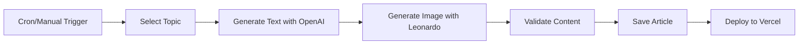

# 🤖 Auto-Blog Schedule - Pisicopedia.ro

## Prezentare Generală

Sistemul de auto-blog pentru Pisicopedia.ro permite generarea automată de articole complete (text + imagine) folosind:
- **OpenAI GPT-4**: Pentru conținut text în limba română
- **Leonardo.ai**: Pentru imagini profesionale generate AI

## Fluxul de Auto-Generare



## Comenzi Disponibile

### Generare Manuală
```bash
# Generează un articol nou (text + imagine)
npm run generate:auto-post

# Validează conținutul generat
npm run validate:content

# Build și verificare finală
npm run build
```

### Verificare Topics Disponibili
Topics-urile sunt definite în `lib/auto-topics.ts` cu 3 nivele de prioritate:
- **High Priority**: 5 topics (simptome comune, probleme frecvente)
- **Medium Priority**: 5 topics (boli specifice, nutriție)
- **Low Priority**: 5 topics (ghiduri educaționale)

## Strategie de Publicare Recomandată

### Faza 1: Launch Intensiv (Primele 2 săptămâni)
```
Frecvență: 2-3 articole/zi
Orar: 10:00, 14:00, 18:00
Focus: High priority topics
```

### Faza 2: Creștere Constantă (Săptămânile 3-8)
```
Frecvență: 1 articol/zi
Orar: 10:00
Focus: Mix high + medium priority
```

### Faza 3: Mentenanță (După 2 luni)
```
Frecvență: 2-3 articole/săptămână
Orar: Marți și Joi la 10:00
Focus: Low priority + topics noi
```

## Automatizare cu Cron Jobs

### Linux/Mac - Crontab
```bash
# Editează crontab
crontab -e

# Adaugă pentru 1 articol/zi la 10:00 AM
0 10 * * * cd /path/to/pisicopedia-app && npm run generate:auto-post >> /var/log/pisicopedia-autoblog.log 2>&1

# Pentru 3 articole/zi (10:00, 14:00, 18:00)
0 10 * * * cd /path/to/pisicopedia-app && npm run generate:auto-post >> /var/log/pisicopedia-autoblog.log 2>&1
0 14 * * * cd /path/to/pisicopedia-app && npm run generate:auto-post >> /var/log/pisicopedia-autoblog.log 2>&1
0 18 * * * cd /path/to/pisicopedia-app && npm run generate:auto-post >> /var/log/pisicopedia-autoblog.log 2>&1
```

### GitHub Actions (Recomandat)
Creează `.github/workflows/auto-blog.yml`:

```yaml
name: Auto-Blog Generator

on:
  schedule:
    # Runs every day at 10:00 AM UTC
    - cron: '0 10 * * *'
  workflow_dispatch: # Allow manual trigger

jobs:
  generate-post:
    runs-on: ubuntu-latest

    steps:
    - uses: actions/checkout@v3

    - name: Setup Node.js
      uses: actions/setup-node@v3
      with:
        node-version: '18'

    - name: Install dependencies
      run: npm install

    - name: Generate auto-blog post
      env:
        OPENAI_API_KEY: ${{ secrets.OPENAI_API_KEY }}
        LEONARDO_API_KEY: ${{ secrets.LEONARDO_API_KEY }}
      run: npm run generate:auto-post

    - name: Validate content
      run: npm run validate:content

    - name: Commit and push if changed
      run: |
        git config --global user.name 'GitHub Actions'
        git config --global user.email 'actions@github.com'
        git add -A
        git diff --quiet && git diff --staged --quiet || (git commit -m "Auto-generated blog post" && git push)

    - name: Trigger Vercel deployment
      uses: amondnet/vercel-action@v20
      with:
        vercel-token: ${{ secrets.VERCEL_TOKEN }}
        vercel-args: '--prod'
```

### Windows Task Scheduler
1. Deschide Task Scheduler
2. Create Basic Task → "Pisicopedia Auto-Blog"
3. Trigger: Daily la 10:00 AM
4. Action: Start a program
5. Program: `npm`
6. Arguments: `run generate:auto-post`
7. Start in: `C:\path\to\pisicopedia-app`

## Monitorizare și Logs

### Log Files
```bash
# Linux/Mac
tail -f /var/log/pisicopedia-autoblog.log

# Windows (PowerShell)
Get-Content C:\logs\pisicopedia-autoblog.log -Wait
```

### Metrici de Urmărit
- ✅ Articole generate cu succes
- ❌ Erori de generare (OpenAI/Leonardo)
- ⚠️ Validări eșuate
- 📊 Topics rămase disponibile

## Gestionare Costuri API

### Estimări Costuri
```
OpenAI (GPT-4o-mini):
- ~1000 tokens/articol
- Cost: ~$0.01/articol

Leonardo.ai:
- 1 imagine/articol
- Cost: ~$0.02/imagine

Total per articol: ~$0.03
Total lunar (30 articole): ~$0.90
```

### Optimizare Costuri
1. Folosește `gpt-4o-mini` pentru eficiență
2. Generează imagini la 1024x576 (nu 4K)
3. Cache rezultate pentru re-generări
4. Monitor rate limits

## Troubleshooting

### Probleme Comune

#### 1. "No topics available"
**Soluție**: Adaugă topics noi în `lib/auto-topics.ts`

#### 2. "OpenAI API rate limit"
**Soluție**: Reduce frecvența sau upgrade plan OpenAI

#### 3. "Leonardo generation failed"
**Soluție**: Verifică credit Leonardo, retry după 10 secunde

#### 4. "Validation failed"
**Soluție**: Verifică structura MDX generată, ajustează prompts

### Comenzi de Debug
```bash
# Verifică topics disponibili
tsx -e "import {autoTopics} from './lib/auto-topics'; console.log(autoTopics.length + ' topics')"

# Test OpenAI connection
tsx -e "import {getOpenAIClient} from './lib/ai-config'; getOpenAIClient()"

# Test Leonardo connection
npm run leonardo:test
```

## Backup și Recovery

### Backup Automat
```bash
# Backup înainte de auto-generare
cp -r content/articles content/articles.backup.$(date +%Y%m%d)

# Restore în caz de probleme
cp -r content/articles.backup.20240115/* content/articles/
```

### Git Hooks
Adaugă în `.git/hooks/pre-commit`:
```bash
#!/bin/sh
npm run validate:content || exit 1
```

## Best Practices

1. **Monitorizează zilnic** primele 2 săptămâni
2. **Revizuiește** articolele generate săptămânal
3. **Actualizează topics** când se epuizează
4. **Backup** înainte de batch generation
5. **Rate limiting** - max 10 articole/oră
6. **A/B testing** - compară articole auto vs manual

## Contact și Suport

Pentru probleme cu auto-blog:
1. Verifică logs
2. Consultă troubleshooting
3. Deschide issue pe GitHub
4. Contact dezvoltator

---

*Ultima actualizare: Noiembrie 2024*